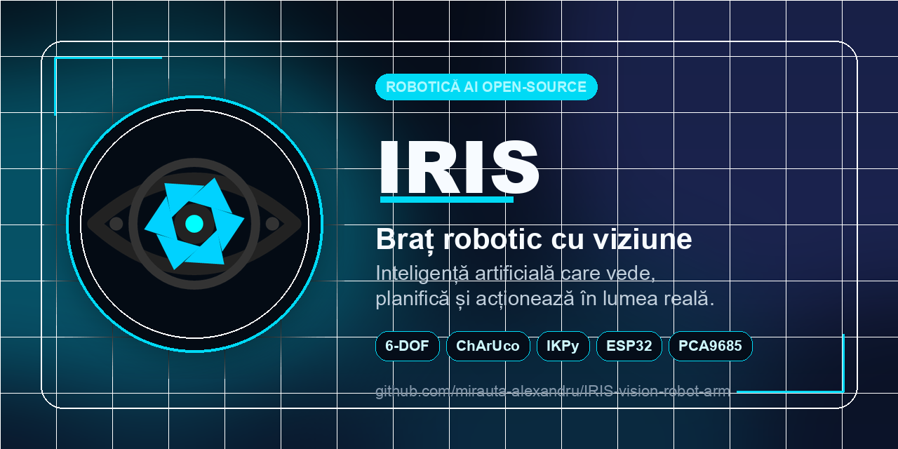

# IRIS Vision Robot Arm

[Versiunea în română](README.ro.md)



**IRIS** stands for **Intelligent Robotic Interactive System**: an open-source, AI-powered 6-DOF robotic arm built to see objects on a table, understand natural language commands, plan manipulation steps, and move a physical arm through computer vision, calibration, inverse kinematics, and ESP32/PCA9685 servo control.

IRIS is not designed as a robot that only replays pre-programmed motions. The goal is to let an AI system receive a new command, inspect the scene in real time, decide what needs to happen, and control the arm through structured functions.

[Project presentation](docs/prezentare-iris.pdf)

## What IRIS Is

IRIS is an autonomous robotics prototype made from a 3D-printed 6-DOF arm, an overhead camera, an AI reasoning layer, ChArUco-based workspace calibration, an IKPy inverse-kinematics stack, and an ESP32/PCA9685 low-level control path.

In practical terms, IRIS can:

- listen and respond through a real-time live interface;
- see the workspace through a camera;
- detect objects and convert image pixels into robot coordinates;
- plan manipulation steps;
- solve inverse kinematics with IKPy;
- send joint targets to an ESP32;
- drive hobby servos through a PCA9685 PWM module;
- be extended with new robot functions without rewriting the whole system.

## Architecture

```text
Layer 3 - Voice and Hearing
  Live interface, microphone, spoken responses, natural-language commands

Layer 2 - Brain
  Gemini Robotics-style embodied reasoning, planning, and function calling

Layer 2 - Eyes
  Camera feed, ChArUco calibration, pixel-to-robot coordinate conversion

Layer 2 - Cerebellum
  IKPy, URDF model, inverse kinematics, servo target generation

Layer 1 - Spine
  ESP32, serial protocol, PCA9685, stable PWM output for servos

Layer 0 - Body
  3D-printed 6-DOF robotic arm, modified gripper, bearings, ATX power supply
```

Technical notes: [docs/ARCHITECTURE.md](docs/ARCHITECTURE.md)

## How It Works

1. The user gives a natural command, such as "pick up the green cube".
2. The camera sends a frame to the vision layer.
3. The system detects the target object and estimates its position on the table.
4. ChArUco calibration converts that image position into robot workspace coordinates.
5. The AI planner breaks the task into steps: approach, align, descend, grasp, lift.
6. IKPy converts the XYZ target into joint angles.
7. The ESP32 receives commands and drives the servos through the PCA9685 module.
8. The camera can be used again to verify the result and make small corrections.

## Repository Layout

```text
files/iris_bridge.py       Main bridge: AI tools, IK, camera, HTTP, serial control
files/iris_live.html       Real-time voice and control interface
files/iris_visualizer.html Browser visualizer for camera, arm state, and commands
files/iris_vision_v3.py    ChArUco workspace calibration
files/calibrate_camera.py  Camera intrinsics calibration
files/iris_arm.urdf        Kinematic model used by IKPy
files/iris_gamepad.py      Optional manual gamepad control
hardware/                  Hardware notes and custom printable parts
docs/                      Architecture, setup, calibration, and project deck
assets/                    Repository images and social preview assets
```

## Hardware

IRIS uses a 6-DOF 3D-printed robotic arm based on MakerWorld design #1134925 by Emre Kalem, with several custom modifications:

- enlarged gripper opening for larger demo objects;
- wire-protection support inside the base;
- 608 and 6203 bearings in selected joints for smoother movement;
- custom enclosure for a recovered HP PS-6241-4HP ATX power supply;
- 5V / 17A servo power rail from the recovered PSU;
- ESP32 WROOM-32D as the low-level controller;
- PCA9685 16-channel PWM module at 50 Hz.

Important electrical rule: **ESP32 GND, PCA9685 GND, and PSU GND must be common**.

## Software Requirements

Main requirements:

- Python 3.11+
- OpenCV with ArUco/ChArUco support
- IKPy
- NumPy / SciPy
- PySerial
- Requests
- Pygame for optional gamepad control
- a Gemini API key for the AI layer

Install dependencies:

```bash
python3 -m venv .venv
source .venv/bin/activate
pip install -r requirements.txt
```

Set your API key:

```bash
export GEMINI_API_KEY="your-key-here"
```

## Quick Start

1. Calibrate the camera intrinsics:

   ```bash
   python files/calibrate_camera.py
   ```

2. Calibrate the robot workspace with the ChArUco board:

   ```bash
   python files/iris_vision_v3.py
   ```

   Place the board on the table, make sure it is fully visible, wait for enough detected corners, then press `SPACE` and `S`.

3. Start the bridge:

   ```bash
   python files/iris_bridge.py
   ```

4. Open the live interface:

   ```text
   http://localhost:8765/live
   ```

## Calibration

The public baseline uses a simple and stable calibration flow:

```text
camera intrinsics -> ChArUco solvePnP -> camera-to-robot transform -> ray-plane intersection
```

Earlier experiments used gripper-marker correction and manual residual maps. They are useful for research, but they can also amplify mechanical issues such as backlash, flex, marker movement, imperfect measurements, or local offsets. For the public baseline, board-only calibration is easier to understand, reproduce, and debug.

Full guide: [docs/CALIBRATION.md](docs/CALIBRATION.md)

## Why IRIS Is Different

IRIS is a step toward robots that do more than replay programmed motions. It sees, listens, reasons, speaks, and acts. The AI layer does not merely describe what should happen; it controls a physical system that tries to do it in the real world.

Most AI still lives behind screens: text, images, code, conversations. IRIS explores what happens when that intelligence gets a body: an object on a table, a spoken command, a planned trajectory, and a real movement.

## Project Status

IRIS is an active prototype. It works as a real AI-controlled robotic arm, but precision depends heavily on:

- camera rigidity;
- ChArUco calibration quality;
- physical board placement;
- servo backlash;
- mechanical flex;
- gripper geometry;
- lighting, object shape, and background.

The current goal is a clean, understandable open-source baseline before adding more complex correction or training layers.

## Roadmap

Possible IRIS V2 directions:

- higher-precision mechanics with better actuators than hobby servos;
- finer manipulation for fragile objects;
- simulation-to-real-world training in Isaac Sim or MuJoCo;
- a dedicated VLA model trained on motion policies;
- custom datasets for detection and manipulation.

## Open Source

This project is public for people who want to learn, build, modify, and push forward the idea of an accessible AI robot.

If you have a 3D printer, some electronics, patience for calibration, and curiosity, this repository is a starting point for building your own version of IRIS.

## License

No license has been selected yet. Add a `LICENSE` file before an official public release.

## Credits

Created by **Mirăuță Alexandru** and **Cardaș Codrin**.

The mechanical arm is based on MakerWorld design #1134925 by **Emre Kalem**, modified for the IRIS project.
