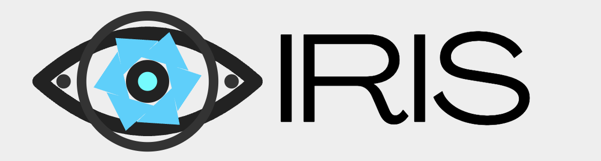

# IRIS - Braț Robotic cu Viziune

[English version](README.md)



**IRIS** vine de la **Intelligent Robotic Interactive System**: un braț robotic cu inteligență artificială și 6 grade de libertate, construit pentru a vedea obiecte pe masă, a înțelege comenzi naturale și a le executa fizic printr-o combinație de viziune, calibrare, cinematică inversă și control pe ESP32.

Proiectul nu este gândit ca un robot cu mișcări preprogramate rigid. Ideea lui IRIS este să primească o comandă nouă, să analizeze scena în timp real, să planifice pașii și să controleze brațul prin funcții structurate.

[Prezentarea proiectului](docs/prezentare-iris.pdf)

## Ordinea de Construire

Ca să construiești IRIS de la zero, urmează proiectul în ordinea asta:

1. Printează 3D și asamblează brațul robotic.
2. Montează electronica: ESP32, PCA9685, servo-uri, alimentare și GND comun.
3. Montează o cameră fixă deasupra spațiului de lucru.
4. Instalează software-ul Python.
5. Calibrează camera.
6. Calibrează spațiul de lucru cu placa ChArUco.
7. Pornește bridge-ul și deschide interfața live.
8. Testează mișcarea manuală înainte de task-uri autonome cu AI.

Piesele care trebuie printate 3D și fișierele hardware trebuie puse în folderul [hardware](hardware). Repo-ul conține deja notițe hardware și carcasa pentru sursa ATX; fișierele complete de print pentru braț vor fi adăugate acolo mai târziu.

Video de referință pentru asamblare:
[video asamblare braț 6-DOF](https://www.youtube.com/watch?v=CHV36hu9z3E)

## Piese Necesare

Piese principale:

- piesele printate 3D pentru brațul robotic 6-DOF;
- ESP32 WROOM-32D;
- driver PWM PCA9685 cu 16 canale;
- servo-uri hobby pentru articulații și clește;
- sursă 5V cu curent mare pentru servo-uri;
- cameră USB sau cameră de telefon montată rigid deasupra mesei;
- placă ChArUco printată drept și lipită pe o suprafață rigidă;
- fire, extensii servo, șuruburi, rulmenți și elemente mecanice de prindere.

Note electrice importante:

- Alimentează servo-urile din sursa externă de 5V, nu din ESP32.
- Leagă împreună GND de la ESP32, PCA9685 și sursa de alimentare.
- ESP32 comunică cu PCA9685 prin I2C: `GPIO21 -> SDA`, `GPIO22 -> SCL`.
- Testează câte un servo pe rând înainte să miști tot brațul.

## Cum Rulezi Software-ul

Clonează repo-ul:

```bash
git clone https://github.com/mirauta-alexandru/IRIS-vision-robot-arm.git
cd IRIS-vision-robot-arm
```

Creează mediul virtual și instalează dependențele:

```bash
python3 -m venv .venv
source .venv/bin/activate
pip install -r requirements.txt
```

Setează cheia Gemini:

```bash
export GEMINI_API_KEY="cheia-ta-aici"
```

Calibrează camera:

```bash
python files/calibrate_camera.py
```

Calibrează spațiul de lucru al robotului:

```bash
python files/iris_vision_v3.py
```

Pornește bridge-ul:

```bash
python files/iris_bridge.py
```

Deschide interfața live:

```text
http://localhost:8765/live
```

Control manual opțional cu manetă:

```bash
python files/iris_gamepad.py
```

## Ce Este IRIS

IRIS este un sistem robotic autonom, format dintr-un braț printat 3D, o cameră montată deasupra spațiului de lucru, un strat de inteligență artificială pentru raționament, calibrare ChArUco pentru transformarea pixelilor în coordonate reale și un sistem ESP32/PCA9685 pentru mișcarea servo-urilor.

Pe scurt, IRIS:

- ascultă și răspunde printr-o interfață în timp real;
- vede scena prin cameră;
- detectează obiecte și le transformă poziția din pixeli în coordonate reale;
- planifică pași de manipulare;
- rezolvă cinematica inversă cu IKPy;
- trimite unghiuri către ESP32;
- controlează servo-urile prin modulul PCA9685;
- poate fi extins cu funcții noi fără a rescrie tot sistemul.

## Arhitectură

```text
Strat 3 - Voce și auz
  Interfață în timp real, microfon, răspuns vocal, comenzi naturale în română

Strat 2 - Creier
  Gemini Robotics / raționament întrupat, planificare și apeluri de funcții

Strat 2 - Ochi
  Cameră, calibrare ChArUco, conversie pixeli -> coordonate robot

Strat 2 - Cerebel
  IKPy, model URDF, cinematică inversă și generare unghiuri servo

Strat 1 - Coloană
  ESP32, protocol serial, PCA9685 și PWM stabil pentru servo-uri

Strat 0 - Corp
  Braț robotic 6-DOF printat 3D, clește modificat, rulmenți și sursă ATX
```

Documentație tehnică: [docs/ARCHITECTURE.md](docs/ARCHITECTURE.md)

## Cum Funcționează

1. Utilizatorul dă o comandă naturală, de exemplu: „ridică cubul verde”.
2. Camera trimite un cadru către stratul de viziune.
3. Sistemul detectează obiectul și calculează unde se află pe masă.
4. Coordonatele sunt transformate în spațiul robotului prin calibrarea ChArUco.
5. Inteligența artificială planifică pașii: apropiere, aliniere, coborâre, prindere, ridicare.
6. IKPy transformă ținta XYZ în unghiuri pentru articulații.
7. ESP32 primește comenzile și controlează servo-urile prin PCA9685.
8. Camera verifică rezultatul și permite ajustări.

## Structura Repo-ului

```text
files/iris_bridge.py       Puntea principală: unelte IA, IK, cameră și serial
files/iris_live.html       Interfața în timp real pentru voce și control
files/iris_visualizer.html Vizualizator în navigator web pentru cameră, braț și comenzi
files/iris_vision_v3.py    Calibrare a spațiului de lucru cu placă ChArUco
files/calibrate_camera.py  Calibrare intrinsecă pentru cameră
files/iris_arm.urdf        Model cinematic folosit de IKPy
files/iris_gamepad.py      Control manual opțional cu manetă
hardware/                  Note pentru partea fizică și piese personalizate
docs/                      Documentație, configurare, calibrare și prezentare
```

## Detalii Hardware

IRIS folosește un braț robotic 6-DOF bazat pe modelul MakerWorld #1134925 de Emre Kalem, dar cu modificări proprii:

- clește mărit, pentru obiecte mai mari decât permitea modelul inițial;
- suport de protecție pentru fire în baza brațului;
- rulmenți 608 și 6203 integrați în articulații pentru mișcare mai lină;
- carcasă dedicată pentru sursa ATX HP PS-6241-4HP;
- alimentare servo dintr-o sursă recuperată de calculator, 5V / 17A;
- ESP32 WROOM-32D pentru control la nivel jos;
- PCA9685 pentru 16 canale PWM stabile la 50 Hz.

Regula electrică importantă: **GND comun între ESP32, PCA9685 și sursa de alimentare**.

## Program și Dependențe

Cerințe principale:

- Python 3.11+
- OpenCV cu suport ArUco/ChArUco
- IKPy
- NumPy / SciPy
- PySerial
- Requests
- Pygame pentru controlul opțional cu manetă
- o cheie API Gemini pentru stratul de inteligență artificială

Instalare:

```bash
python3 -m venv .venv
source .venv/bin/activate
pip install -r requirements.txt
```

Setare cheie API:

```bash
export GEMINI_API_KEY="cheia-ta-aici"
```

## Listă Rapidă de Pornire

1. Calibrează camera:

   ```bash
   python files/calibrate_camera.py
   ```

2. Calibrează spațiul de lucru cu placa ChArUco:

   ```bash
   python files/iris_vision_v3.py
   ```

   Așază placa pe masă, asigură-te că este văzută complet, așteaptă suficiente colțuri detectate, apoi apasă `SPACE` și `S`.

3. Pornește bridge-ul:

   ```bash
   python files/iris_bridge.py
   ```

4. Deschide interfața în timp real:

   ```text
   http://localhost:8765/live
   ```

## Calibrare

IRIS folosește ca bază publică o calibrare simplă și stabilă:

```text
intrinseci cameră -> ChArUco solvePnP -> transformare cameră-robot -> intersecție rază-plan
```

Am evitat să păstrăm ca bază corecțiile experimentale cu marker pe clește sau hărți manuale de eroare, pentru că pot amplifica problemele mecanice: joc în articulații, flex, marker mișcat, poziții măsurate imperfect sau offseturi locale.

Ghid complet: [docs/CALIBRATION.md](docs/CALIBRATION.md)

## De Ce IRIS E Diferit

IRIS este un pas spre roboți care nu repetă doar mișcări programate. Sistemul vede, ascultă, gândește, vorbește și acționează. Inteligența artificială nu doar descrie ce ar trebui făcut, ci controlează un corp fizic care încearcă să facă acel lucru în lumea reală.

Până acum, inteligența artificială a trăit mai ales în ecrane: text, imagini, cod, conversații. IRIS încearcă să ducă această inteligență în spațiul fizic: un obiect pe masă, o comandă vocală, o traiectorie planificată și o mișcare reală.

## Stadiu

IRIS este un prototip activ. Funcționează ca braț robotic cu inteligență artificială real, dar precizia depinde de:

- rigiditatea camerei;
- calitatea calibrării ChArUco;
- poziția fizică a plăcii de calibrare;
- jocul mecanic al servo-urilor;
- flexul brațului;
- geometria cleștelui;
- lumină, obiecte și fundal.

Obiectivul actual este o bază cu sursă deschisă, simplă, curată și ușor de refăcut înainte de adăugarea unor straturi mai complexe de corecție sau antrenare.

## Ce Urmează

Direcții posibile pentru IRIS V2:

- mecanică de precizie, cu actuatoare mai bune decât servo-urile hobby;
- manipulare mai fină pentru obiecte fragile;
- antrenare în simulare și transfer pe robotul real, în Isaac Sim sau MuJoCo;
- model VLA dedicat, antrenat pentru politici de mișcare;
- seturi de date proprii pentru detecție și manipulare.

## Sursă Deschisă

Proiectul este public pentru oameni care vor să învețe, să construiască, să modifice și să ducă mai departe ideea unui robot AI accesibil.

Dacă ai o imprimantă 3D, puțină electronică, răbdare la calibrare și curiozitate, poți să pornești de aici și să îți construiești propria versiune de IRIS.

## Licență

Licența nu este aleasă încă. Adaugă un fișier `LICENSE` înainte de o lansare publică oficială.

## Credite

Creat de **Mirăuță Alexandru** și **Cardaș Codrin**.

Brațul mecanic este bazat pe modelul MakerWorld #1134925 de **Emre Kalem**, modificat pentru proiectul IRIS.
